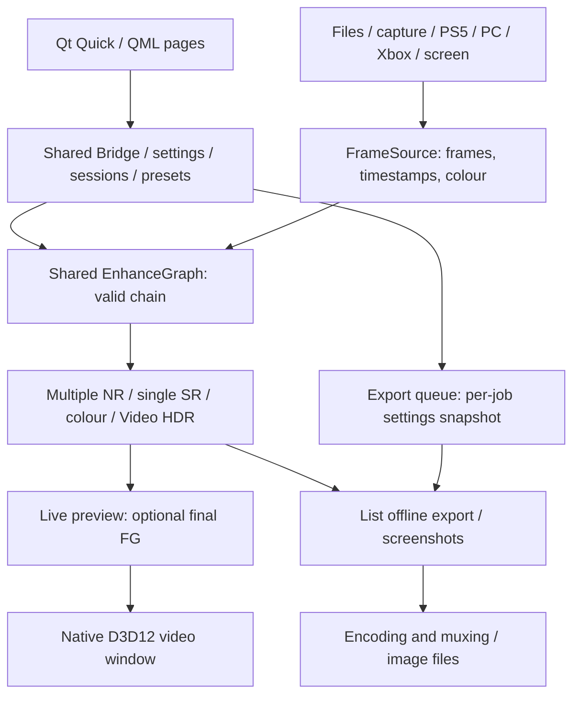

# Veyra

  

English | [简体中文](README_CN.md)

A Windows enhancement player for videos, images, capture cards and streaming. Super-resolution, NR, colour grading, RTX Video HDR and frame generation share one engine. Community enhancements remain experimental.

[Download 2.0.2 portable](https://github.com/Likely7/Veyra-NRVideo/releases/tag/v2.0.2) · [Full changelog: English / 中文](docs/RELEASE_NOTES_2.0.2.md) · [Issues](https://github.com/Likely7/Veyra-NRVideo/issues)

## Highlights

- **Rebuilt interface:** Home, Cinema, Professional List, Nodes, Colour, Export and Settings; Simplified/Traditional Chinese, English and Japanese.
- **Node editing and layered NR:** executable connections, independent NR/colour parameters, separate List/Node configurations, sessions and presets.
- **PC / Xbox streaming:** Moonlight/Sunshine-compatible PC streaming and unofficial experimental Xbox support, alongside PS5, capture cards and screen capture.
- **New export workflow:** editable ordered queue, trimming, MP4/MKV, multiple audio/embedded subtitle tracks, cancellation/retry and completion sound.
- **Enhancement and compatibility:** three NR runtime choices (NVIDIA original for RTX 50, Lecram and SF-v2), DLSS/XeSS/FSR options, capture improvements and a persistent OBS Game Capture switch with restart confirmation. Full details are in the Release.

## New in 2.0.2

- Restore NVIDIA original NR as a third choice; existing Lecram/SF-v2 settings remain valid.
- Optional startup resume reopens the last movie at its saved position or starts the saved capture card configuration. Choose Cinema or Professional as your startup page.
- Both playback bars offer 1× / 1.5× / 2× / 3× movie speed with preserved audio pitch.
- Automatic RTSS compatibility, Xbox negotiation/shutdown fixes, VRR capture timing repair and GPU-reset export recovery. Fullscreen VRAM fallback is optional and **off by default**; the reported 5060 Ti leak itself remains unconfirmed.

## Install and upgrade

Download **Veyra-2.0.2-win64-portable.zip**, extract into a new writable folder and run **veyra_qml_ui.exe**. This is the only release asset you need to run the application. Windows 11 x64 and DirectX 12 are required; Qt and approved runtimes are included, while GPU/capture drivers are installed separately. Backend hardware requirements vary; most local tests used an RTX 5070.

Start with effects off, check picture/sound, then enable effects individually. High resolution, layered NR and frame generation increase GPU/VRAM requirements.

**The 1.4.4 UI guide is obsolete.** Version 2.0 uses separate settings. Retain the old version for rollback; do not overwrite the new package with old `veyra.ini`, an entire `runtime_local` folder or mixed DLLs.

## Using 2.0

### Sources and pages

Home offers files, capture card, PS5, PC, Xbox and screen capture. Files/images can also be dropped into the window. Move to the bottom edge to reveal navigation between Home, Cinema, Professional, Colour, Export and Settings.

- Cinema prioritises the picture with a floating source/transport/audio/fullscreen bar, optionally hidden in settings.
- Professional List has Picture, Frame generation, Colour, Sound and Display tabs. The order strip locates effects; bottom panels report source/output, GPU stage time and load.
- Click a file's picture to pause/resume; left/right arrows seek five seconds. Double-click or use the fullscreen button. The fullscreen top-edge bar switches Cinema/Professional; **Home** opens quick controls in fullscreen List mode, **Ctrl+L** locks controls. Shortcuts are configurable.
- Use Screenshot and the preset menu to save pictures and personal settings. No imposed built-in quality presets.

### List mode

The NR version selector offers RTX 50 · NVIDIA original, RTX 50 · Lecram and RTX 20–50 · SF-v2 in both List and Node mode. It switches the entire NR chain, retaining the existing default. See [runtime identities](docs/RUNTIME_COMPONENTS_2.0.2.md).

Select List at the top of Professional. Enable SR, NR or RTX Video HDR as needed. Up to four NR layers have independent internal resolution, strength and parameters. The master switch disables all layers and restores their previous enabled states.

List mode's global NR protection region excludes every NR layer inside it while retaining non-NR effects, useful for HUDs/subtitles. Colour controls include basic adjustments, curves, mixer, wheels, LUTs and colour presets.

Choose a supported FG backend/multiplier and check cadence, display sync, low-queue mode and output cap. Original/enhanced comparison temporarily pauses FG; leaving it resumes FG. Submitted FPS is not physical display FPS or end-to-end latency.

### Node mode — build a processing chain

Select Nodes at the top of Professional. This is an executable chain editor:

1. Keep a valid connected path from input to output. Right-click blank canvas or choose Add node.
2. Drag an output port to an input port, or click the two ports in order. Drop a node on a wire to insert; drag it away or release with **Alt** held to disconnect.
3. Edit parameters inside nodes. NR/colour nodes have independent settings and supported positions before/after SR. Right-click to delete, duplicate or reset. A duplicate is an independent **disconnected copy** until connected.
4. **Middle-drag to pan, wheel to zoom.** Fit/auto-layout organise the graph. “Draft not running” means invalid/disconnected edits, not that every visible node executes.
5. Optical flow is shared after input; SR is a single instance. RTX Video HDR stays before final FG; select one DLSS/XeSS/FSR backend. This is not an arbitrary branching/mixing graph.
6. List and Node settings, presets and sessions are separate. Returning to List restores its settings and retains the node graph. Switching rebuilds processing and may briefly pause the picture.

**2.0.2 Node mode does not support offline export or List mode's global NR protection region.** Switch to List and verify its effects before exporting; graphs are not silently converted.

### Capture and streaming

| Source | Setup |
|---|---|
| Capture card | Select device, format, resolution, rate and audio input. Close competing apps. Match PQ/HLG/709 and Limited/Full to the signal. Magewell Pro Capture has a dedicated low-latency option. |
| PS5 | Enable Remote Play, discover/enter IP, use PSN Account ID and the console's eight-digit pairing code; reconnect saved hosts. |
| PC | Install/configure Sunshine yourself; discover/add the host, PIN-pair, select app/desktop and connect. Sunshine is not bundled. |
| Xbox | Follow device-code sign-in and select a console with remote features enabled. Unofficial/experimental; account, service and console restrictions apply. |
| Screen | Select a window/display; avoid recursively capturing Veyra itself. |

Pausing capture/streaming freezes the preview while keeping the session, not the host game. Physical hardware, networks, HDR and controllers need individual validation.

### Export

Use **List mode**, confirm effects, then open Export. Add/reorder files, edit individual jobs, trim, select MP4/MKV and encoding quality, and keep all or selected audio/subtitle tracks.

Keep all skips unsupported tracks with a notice; explicitly choosing an incompatible track is an error. Pause/cancel/retry and completion sound are available. Defaults are VBR 8 Mbps and closing playback on export to free GPU resources, both adjustable. Live FG does not imply every backend supports offline FG; follow accepted export settings.

### OBS and settings

For OBS Game Capture, enable **Settings → General & appearance → OBS Game Capture compatibility**. Saved immediately: Yes restarts now; No applies next launch. Finish exports before restarting. Software UI rendering simplifies some shadows/blur; video enhancement stays on GPU. Game Capture targets **video**; use Windows 10 (1903+) Window Capture for the whole UI.

**Settings → General & appearance → Resume last source at startup** is opt-in. It restores the movie position or saved capture device, format, rate and audio selection. Startup page is configurable. Use the playback-speed button in Cinema or Professional for 1× / 1.5× / 2× / 3×; this does not speed up live capture/streams or offline exports.

**Monitoring compatibility** defaults to Auto: when RTSS (MSI Afterburner OSD) is running at launch, the interface uses software rendering and its OSD appears on the video only. If RTSS starts later, restart Veyra when prompted. Using RTSS with OBS Game Capture requires RTSS’s “Use Microsoft Detours API hooking” option for Veyra, or use OBS Window Capture.

Settings include language/scale, shortcuts, monitoring GPU, audio devices and component info. Report GPU/driver, media, effects, time and `logs/veyra-qml.log`; include a crash `.dmp` if available. Review private data before sharing.

## Limitations

RTSS compatibility was verified locally with RTSS 7.3.7 on an RTX 5070; GamePP and other overlay/hardware combinations remain unverified. Real-console Xbox long runs and console/VRR capture still need field retesting. RTX 30/40 community NR/FG, FSR 4 ML hardware, some NR TDR/VRAM-growth reports and cross-device streaming retain unresolved/unverified cases. See the Release. Community runtimes are not vendor certification or a complete official DLSS 5 integration.

## Architecture

QML renders UI; native D3D12 renders video. List/Nodes share the engine, disconnected drafts do not execute, and export does not record the preview window.

## Source and build

Original code: GPL-3.0. The combined Chiaki streaming application is also subject to AGPL-3.0 and its OpenSSL exception (licenses/remoteplay). [Third-party notices](THIRD_PARTY_NOTICES.md), [2.0.2 build/source](docs/BUILD_2.0.2.md). Source Git excludes proprietary runtimes/models. Release manifests audit publisher files, not hash-lock user DLL replacements.

## Support

  
  &nbsp;&nbsp;&nbsp;&nbsp;
  

Left: optional donation, no feature restrictions. Right: community group; QR valid **before 2026-10-09** as shown. Check repository updates after expiry.
