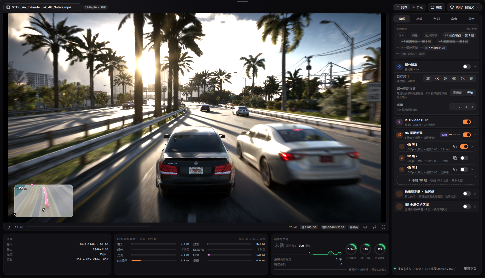
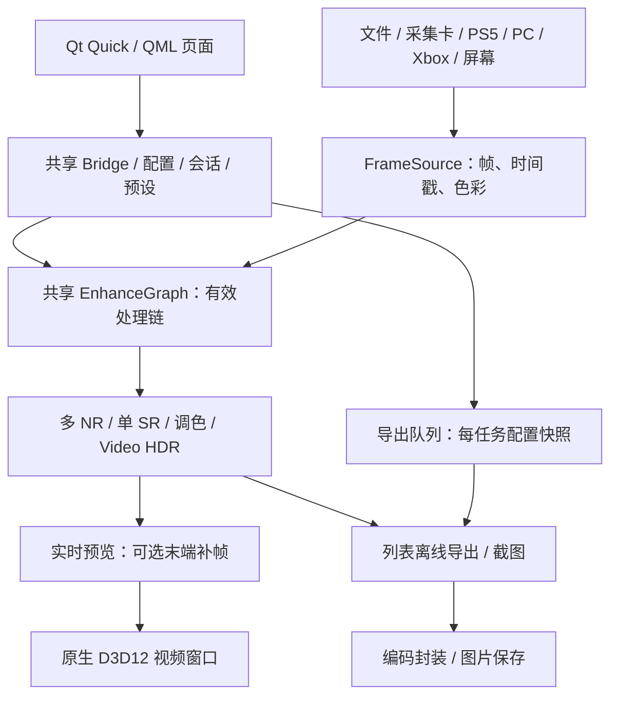

# Veyra

  

[English](README.md) | 简体中文

Windows 视频、图片、采集卡与串流增强工具。在同一处理链组合超分辨率、NR 画面增强、调色、RTX Video HDR 与补帧。社区增强能力保留实验性质。

[下载 2.0.3 免安装版](https://github.com/Likely7/Veyra-NRVideo/releases/tag/v2.0.3) · [完整更新（English / 中文）](docs/RELEASE_NOTES_2.0.3.md) · [反馈](https://github.com/Likely7/Veyra-NRVideo/issues)

**本地开发进度，2026-10-05：** 此分支另含RTSS重启、自定义倍速、字幕、UI刷新、专业布局和全屏恢复修复，公开2.0.3包尚未包含。本机全部NR优化节点已有实测保留/拒绝处置：保留核心复用、单NR缓存、空闲预热、暂停复用、限定COMPUTE和NVENC导出调度；自动NR及先粗后细会改画面，只作可选。正常匹配对照单层原生NR约6.1ms，双NR+SR4K+DLSS2X整链减少3.52%，软件提交P99几乎未变。[执行账本](docs/PERF_EXECUTION_NR_2026-10-04.md)和[最终回归记录](docs/PERF_R0_ACCEPTANCE_2026-10-05.md)列明数据与限制。严重后台掉帧仍未确认根因；OBS游戏采集使用现有兼容模式，GPU界面捕获在封存基线也不稳定。HDR/杜比PR继续暂缓。

## 2.0.0 重点

- **全新界面**：首页、极简、专业列表、节点、调色、导出和设置重新组织；支持简中、繁中、English、日本語。
- **节点编辑与多层 NR**：连线编排处理顺序，NR/调色独立参数；列表与节点各自保存配置、会话和预设。
- **PC / Xbox 串流**：Moonlight/Sunshine 协议 PC 串流、非官方实验 Xbox 接入，与 PS5、采集卡、屏幕捕获共用增强。
- **导出页重做**：可编辑顺序队列、剪辑、MP4/MKV、多音轨/内嵌字幕、取消重试和完成提示音。
- **增强与兼容**：NR 四版本（50 系 NVIDIA 原版、Lecram、SF-v2、AMD lmxxf）、DLSS/XeSS/FSR 补帧入口、采集优化及带重启确认的 OBS 游戏采集开关。详细新功能与修复见 Release。

## 2.0.3 新增与修复

- **显卡分包**：NVIDIA 包不带 AMD NR；AMD 包不带 NVIDIA NR/NGX/VFG/CUDA。按用户追加决定，两包都保留原有 FidelityFX 2.3.0 共用组件，FSR3.1/XeSS 可用，NVIDIA 的 FSR4 入口置灰。
- **功能可见但禁用**：NR 四版本、超分、补帧、RTX HDR、光流与节点添加统一判断硬件/组件，并显示禁用原因。恢复旧配置关闭不可用效果，保留参数。
- **VFG 与现场修复**：VFG 全部 2–8X、低/中/高；Xbox 音频启动与有界恢复；导出码率草稿/验证/worker 冻结；小飞机兼容背景不透明；移除 NVIDIA App 插件误判；修复极简右侧像素黑边。删除九个 VFG 不使用的 NPP 库。RX9000 推理和 Xbox 真机长稳仍待验，HDR/杜比 PR 暂缓。

- 恢复 50 系 NVIDIA 原版 NR，与 Lecram、SF-v2 共三版切换，已有设置保留。
- 设置可开启启动自动继续上次视频及进度，或按已保存的采集卡配置直接开始；启动页可选极简或专业。
- 极简与专业播放栏都支持 1× / 1.5× / 2× / 3× 视频倍速，声音保调。
- 加入小飞机 RTSS 自动兼容，修复 Xbox 协商/关闭异常与 VRR 采集时序；包含 GPU 重置后断点续导。全屏显存异常自动退窗改为可选开关，**默认关闭**，5060 Ti 显存增长根因仍未确认。

## 下载、启动与升级

1. 按 Veyra 实际使用的显卡下载 **Veyra-2.0.3-NVIDIA-win64-portable.7z** 或 **Veyra-2.0.3-AMD-win64-portable.7z**，用 7-Zip 完整解压到可写新目录，运行 **veyra_qml_ui.exe**。运行只需一个显卡包，源码包仅供重编译。
2. Windows 11 x64、DirectX 12；无需安装 Qt、Python 或开发 SDK。显卡/采集卡驱动仍需安装。后端各有硬件要求，主要实测显卡为 RTX 5070。
3. 先关闭效果确认基础画面和声音，再逐项开启。8K、多层 NR 和补帧会增加显存与处理时间，不保证所有组合实时运行。
4. **1.4.4 教程不再适用。** 2.0 使用独立配置目录，保留旧版用于回退；不要直接复制旧 `veyra.ini`、整个 `runtime_local` 或混装 DLL 覆盖新版。

## 新版操作

### 片源与页面

首页选择 **打开视频、采集卡、PS5 串流、PC 串流、Xbox 串流、屏幕捕获**；本地视频/图片也可拖入。底部导航切换首页、极简、专业、调色、导出和设置；隐藏时移到下沿唤出。

- **极简**以画面为主，悬浮条控制片源、进度、音量和全屏，可在设置中隐藏。
- **专业列表**右侧为画质、补帧、色彩、声音、显示；顶部处理顺序可定位设置，底部显示输入/输出、GPU 耗时和负载。
- 文件画面点击暂停/继续，左右键跳转 5 秒；双击或点按钮切全屏。全屏移到顶沿可切换极简/专业，列表全屏按 **Home** 打开快速调节，**Ctrl+L** 锁定控制条。快捷键可在设置修改。
- 顶部 **截图** 保存处理画面；预设菜单保存、管理、导入自己的配置，不强加内置画质预设。

### 列表模式

列表与节点的 **NR 版本** 均可选四项：RTX 50 · NVIDIA 原版、RTX 50 · Lecram、RTX 20–50 · SF-v2、RX9000 · lmxxf（实验）。不支持的版本保留置灰，支持的版本切换时全 NR 链同步。AMD NR 需要驱动 HIP 7，内部最高 1080p 像素预算，HDR/原生 1440p/4K NR 导出不支持。[运行组件身份](docs/RUNTIME_COMPONENTS_2.0.3.md)。

顶部选 **列表**，按需开启超分、NR、RTX Video HDR。NR 最多四层，独立调整内部尺寸、强度等参数；总开关关闭全部 NR，重开恢复各层原状态。

列表的 **NR 全局保护区域**排除区域内全部 NR 层效果，保留非 NR 处理结果，可用于 HUD/字幕。调色页提供基础调整、曲线、混色器、色轮、LUT 与颜色预设。

补帧页选可用后端/倍率，并核对内容节奏、显示同步、低延迟队列、输出上限。原画/增强对比期间补帧暂停，退出恢复。提交 FPS 不等于物理屏幕显示帧数或端到端延迟。

### 节点模式：编排自己的处理链

专业页顶部选 **节点**。这是实际执行的处理链，不只是示意图。

1. 从输入到输出保持有效连接。空白处右键或点 **添加节点**。
2. 拖动输出端口到输入端口，或依次点击两端。节点拖到线上可插入；拖离主链或按住 **Alt** 松手可断开。
3. 在节点内直接调参数，NR/调色可独立设置、按允许顺序放在超分前后。右键可删除、复制、重置；复制产生独立的**未连接副本**，接入前不运行。
4. **中键平移、滚轮缩放**；适配视图/自动排列整理布局。“草稿未运行”表示编辑链未连通或不合法，不代表所有可见节点都生效。
5. 光流在输入后计算并共享，超分为单实例；RTX Video HDR 在补帧前，补帧固定末端，DLSS/XeSS/FSR 选一个后端。不是任意分支混合图。
6. 列表和节点分别保存参数、预设、会话。切回列表恢复原列表配置，节点链保留；切换重建处理链，可能短暂停顿。

**2.0.3 节点模式不支持离线导出，也没有列表的 NR 全局保护区域。** 导出前切回列表并确认效果，不会自动转换节点链。

### 采集与串流

| 来源 | 操作要点 |
|---|---|
| 采集卡 | 选设备、格式、尺寸、帧率和音频输入；关闭其他程序占用。PQ/HLG/709、Limited/Full 匹配实际信号。美乐威 Pro Capture 有专用低延迟选项。 |
| PS5 | 主机启用远程游玩，搜索或手填 IP，使用 PSN Account ID 和主机八位配对码；已保存主机可重连。 |
| PC | 主机自行安装配置 Sunshine；Veyra 发现/添加主机、PIN 配对、选应用或桌面连接。Sunshine 不随包安装。 |
| Xbox | 按设备码流程登录，选开启远程功能的主机。非官方实验功能，服务、账号与主机限制可能影响连接。 |
| 屏幕 | 选窗口/显示器，避免捕获 Veyra 自身形成递归。 |

暂停采集/串流冻结预览并保留会话，不会暂停主机游戏。实卡、网络、HDR、手柄需按设备验证。

### 导出

切到**列表**确认效果，再打开导出页。添加文件后可排序、逐项修改、设置剪辑、MP4/MKV 与编码质量；音轨/内嵌字幕可保留全部或指定。

“保留全部”遇到封装不支持的轨道会跳过并提示；明确指定不支持轨道则报错。可暂停、取消重试，完成可响铃。默认 VBR 8 Mbps、导出时关闭当前播放以释放 GPU，可修改。实时补帧不代表所有后端支持离线补帧，以导出页接受的配置为准。

### OBS 与设置

OBS 游戏采集前，开启 **设置 → 通用与外观 → OBS 游戏采集兼容**。立即保存，选“是”重启生效，“否”下次生效；导出时需等任务结束。兼容模式 UI 软件绘制，部分阴影/模糊简化，视频增强仍用 GPU。游戏采集抓**视频**；录完整界面用 Windows 10 (1903+) 窗口采集。

**设置 → 通用与外观 → 启动后自动继续上次内容** 可选开启，恢复视频及进度，或采集卡设备、格式、帧率与音频配置；启动页面可选择极简或专业。双页面播放栏的倍速按钮可选 1× / 1.5× / 2× / 3×，不改变采集/串流和离线导出的速度。

**监控软件兼容** 默认“自动”：启动时检测到小飞机 RTSS，界面软件绘制，OSD 只显示在视频上。RTSS 后启动时按提示重启 Veyra。与 OBS 游戏采集同开，在 RTSS 给 Veyra 开启 “Use Microsoft Detours API hooking”，或改用 OBS 窗口采集。

设置还包含语言/缩放、快捷键、GPU 监控显卡、音频设备、组件信息。反馈附显卡/驱动、素材、效果组合、发生时间及 `logs/veyra-qml.log`，崩溃附 `.dmp`；分享前检查私人信息。

## 已知边界

RTSS 7.3.7 在本机 RTX 5070 已验证兼容，游戏加加及其他叠加层/显卡组合尚未验证。真实 Xbox 长时间串流、主机经 VRR 采集卡输入仍待现场复测。RTX 30/40 社区 NR/补帧、FSR 4 ML 实卡、部分 NR TDR/显存增长与跨设备串流仍有未验证或未解决项，详见 Release。社区运行库不代表厂商认证或完整官方 DLSS 5 集成。

## 架构

QML 管界面，视频由原生 D3D12 呈现。列表/节点共用引擎，未连接草稿不运行；导出不是录制预览窗口。

## 开源与构建

Veyra 原有代码 GPL-3.0；含 Chiaki 串流的组合程序同时适用 AGPL-3.0 与上游 OpenSSL 例外（见 licenses/remoteplay）。[第三方来源与许可](THIRD_PARTY_NOTICES.md)、[2.0.3 构建与对应源码](docs/BUILD_2.0.3.md)。源码与运行库/模型分离；Release manifest 用于发行审计，不用哈希锁阻止用户替换 DLL。

## 支持与反馈

  
  &nbsp;&nbsp;&nbsp;&nbsp;
  

左：微信赞助（自愿，不影响功能）；右：交流群。群码按图片标注于 **2026-10-09 前**有效，过期请查看仓库更新。
