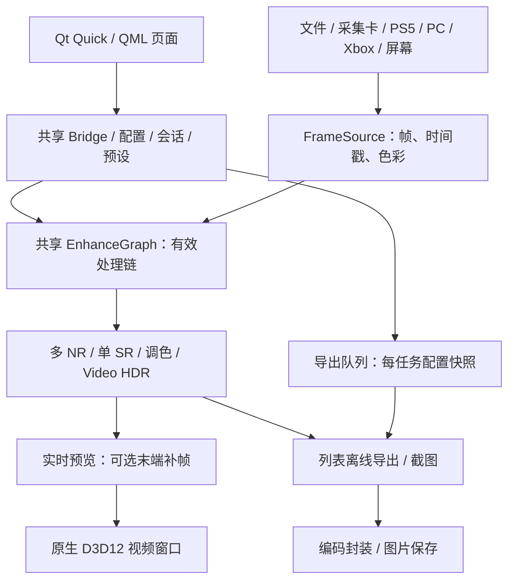

# Veyra

  

[English](README.md) | 简体中文

Windows 视频、图片、采集卡与串流增强工具。在同一处理链组合超分辨率、NR 画面增强、调色、RTX Video HDR 与补帧。社区增强能力保留实验性质。

[下载 2.0.6 免安装版](https://github.com/Likely7/Veyra-NRVideo/releases/tag/v2.0.6) · [完整更新（English / 中文）](docs/RELEASE_NOTES_2.0.6.md) · [反馈](https://github.com/Likely7/Veyra-NRVideo/issues)

**2.0.6 正式版，2026-10-07：** 优化VFG实时提交，修复NR→FSR结果被原图覆盖，增加Blackmagic/DeckLink采集兼容与驱动属性入口。详见[完整更新](docs/RELEASE_NOTES_2.0.6.md)。

**VFG实测：** 本机RTX5070、GTA 4K30、单层内部1080p原版NR、实际普通优先级，相邻对照中Medium 4X送显提交读数 **80→120fps（+50%）**，High 2X **35.5→60fps（+69%）**。这是该环境的软件提交数据，不是所有显卡的保证或屏幕延迟收益。Medium 6X以上、High 3X以上仍有限制；**NVIDIA显存持续增长尚未修复**。AMD真实推理/主机和Blackmagic实卡需继续复测。[条件与边界](docs/RELEASE_NOTES_2.0.6.md)。

## 2.0.0 重点

**2.0.4 NR 调控：** 每层 NR 的“增强变化量 → 总变化强度”最高为 5。“画面调控”默认关闭，开启可选自动／手动。自动分别适配风格 0／1／2，新增力度滑块（0 保留原始强度，1 完整纠偏）。手动共九项：色相、色度、中性色、原图色彩保留、亮度保持、暗部、高光、局部压缩和时域稳定；“采用当前风格的自动参数”可作为手动起点。切换方式保留手动数值，关闭调控保留原始残差算法。5 是一次推理结果的残差外推，保护会降低对应变化量，不能保证所有素材在完整局部增益 5 下无失真。预设、列表／节点会话、PNG 与视频导出共用这些设置。验收与已知限制见[本轮记录](docs/NR_STRENGTH_PROTECTION_EXECUTION_2026-10-05.md)。

- **全新界面**：首页、极简、专业列表、节点、调色、导出和设置重新组织；支持简中、繁中、English、日本語。
- **节点编辑与多层 NR**：连线编排处理顺序，NR/调色独立参数；列表与节点各自保存配置、会话和预设。
- **PC / Xbox 串流**：Moonlight/Sunshine 协议 PC 串流、非官方实验 Xbox 接入，与 PS5、采集卡、屏幕捕获共用增强。
- **导出页重做**：可编辑顺序队列、剪辑、MP4/MKV、多音轨/内嵌字幕、取消重试和完成提示音。
- **增强与兼容**：NR 四版本（50 系 NVIDIA 原版、Lecram、SF-v2、AMD lmxxf）、DLSS/XeSS/FSR 补帧入口、采集优化及带重启确认的 OBS 游戏采集开关。详细新功能与修复见 Release。

## 2.0.6 新增与修复

- **VFG实时优化**：有界异步提交避免SDK调用阻塞送显；保留逐帧成功检查、队列上限和退出清理，导出继续使用同步判定。
- **AMD NR→FSR**：超分及首帧/断点缩放使用NR处理结果，修复1080p视频与串流开关NR看不到变化的链路错误。
- **Blackmagic/DeckLink**：补齐WDM上游连接，原生识别HDYC/BT709；增加设备/输入属性页、精确格式恢复和持续黑帧提示，实卡仍需复测。
- **交流群**：更新为5群二维码，微信赞助、Discord和Ko-fi保留。

[2.0.6 完整更新、实测数据与验收边界](docs/RELEASE_NOTES_2.0.6.md)。

## 下载、启动与升级

1. 按 Veyra 实际使用的显卡下载 **Veyra-2.0.6-NVIDIA-win64-portable.zip** 或 **Veyra-2.0.6-AMD-win64-portable.zip**，用 Windows 或 7-Zip 完整解压到可写新目录，运行 **veyra_qml_ui.exe**。运行只需一个显卡包，源码包仅供重编译。
2. Windows 11 x64、DirectX 12；无需安装 Qt、Python 或开发 SDK。显卡/采集卡驱动仍需安装。后端各有硬件要求，主要实测显卡为 RTX 5070。
3. 先关闭效果确认基础画面和声音，再逐项开启。8K、多层 NR 和补帧会增加显存与处理时间，不保证所有组合实时运行。
4. **1.4.4 教程不再适用。** 2.0 使用独立配置目录，保留旧版用于回退；不要直接复制旧 `veyra.ini`、整个 `runtime_local` 或混装 DLL 覆盖新版。

## 新版操作

### 片源与页面

首页选择 **打开视频、采集卡、PS5 串流、PC 串流、Xbox 串流、屏幕捕获**；本地视频/图片也可拖入。底部导航切换首页、极简、专业、调色、导出和设置；隐藏时移到下沿唤出。

- **极简**以画面为主，悬浮条控制片源、进度、音量和全屏，可在设置中隐藏。
- **专业列表**右侧为画质、补帧、色彩、声音、显示；顶部处理顺序可定位设置，底部显示输入/输出、GPU 耗时和负载。
- 文件画面点击暂停/继续，左右键跳转 5 秒；双击或点按钮切全屏。全屏移到顶沿可切换极简/专业，列表全屏按 **Home** 打开快速调节，**Ctrl+L** 锁定控制条。快捷键可在设置修改。
- 顶部 **截图** 保存处理画面；预设菜单保存、管理、导入自己的配置，不强加内置画质预设。

### 列表模式

列表与节点的 **NR 版本** 均可选四项：RTX 50 · NVIDIA 原版、RTX 50 · Lecram、RTX 20–50 · SF-v2、RX9000 · lmxxf（实验）。不支持的版本保留置灰，支持的版本切换时全 NR 链同步。AMD NR需要驱动HIP 7；视频最高内部1080p推理并合成原尺寸输出，不等于原生4K NR，实卡离线编码待复测；图片保持原尺寸模型预算，HDR NR不可用。[运行组件身份](docs/RUNTIME_COMPONENTS_2.0.3.md)。

顶部选 **列表**，按需开启超分、NR、RTX Video HDR。NR 最多四层，独立调整内部尺寸、强度等参数；总开关关闭全部 NR，重开恢复各层原状态。

列表的 **NR 全局保护区域**排除区域内全部 NR 层效果，保留非 NR 处理结果，可用于 HUD/字幕。调色页提供基础调整、曲线、混色器、色轮、LUT 与颜色预设。

补帧页选可用后端/倍率，并核对内容节奏、显示同步、低延迟队列、输出上限。原画/增强对比期间补帧暂停，退出恢复。提交 FPS 不等于物理屏幕显示帧数或端到端延迟。

### 节点模式：编排自己的处理链

专业页顶部选 **节点**。这是实际执行的处理链，不只是示意图。

1. 从输入到输出保持有效连接。空白处右键或点 **添加节点**。
2. 拖动输出端口到输入端口，或依次点击两端。节点拖到线上可插入；拖离主链或按住 **Alt** 松手可断开。
3. 在节点内直接调参数，NR/调色可独立设置、按允许顺序放在超分前后。右键可删除、复制、重置；复制产生独立的**未连接副本**，接入前不运行。
4. **中键平移、滚轮缩放**；适配视图/自动排列整理布局。“草稿未运行”表示编辑链未连通或不合法，不代表所有可见节点都生效。
5. 光流在输入后计算并共享，超分为单实例；RTX Video HDR 在补帧前，补帧固定末端，DLSS/XeSS/FSR 选一个后端。不是任意分支混合图。
6. 列表和节点分别保存参数、预设、会话。切回列表恢复原列表配置，节点链保留；切换重建处理链，可能短暂停顿。

**2.0.6 节点模式不支持离线导出，也没有列表的 NR 全局保护区域。** 导出前切回列表并确认效果，不会自动转换节点链。

### 采集与串流

| 来源 | 操作要点 |
|---|---|
| 采集卡 | 选设备、格式、尺寸、帧率和音频输入；关闭其他程序占用。PQ/HLG/709、Limited/Full 匹配实际信号。美乐威 Pro Capture 有专用低延迟选项。 |
| PS5 | 主机启用远程游玩，搜索或手填 IP，使用 PSN Account ID 和主机八位配对码；已保存主机可重连。 |
| PC | 主机自行安装配置 Sunshine；Veyra 发现/添加主机、PIN 配对、选应用或桌面连接。Sunshine 不随包安装。 |
| Xbox | 按设备码流程登录，选开启远程功能的主机。非官方实验功能，服务、账号与主机限制可能影响连接。 |
| 屏幕 | 选窗口/显示器，避免捕获 Veyra 自身形成递归。 |

暂停采集/串流冻结预览并保留会话，不会暂停主机游戏。实卡、网络、HDR、手柄需按设备验证。

### 导出

切到**列表**确认效果，再打开导出页。添加文件后可排序、逐项修改、设置剪辑、MP4/MKV 与编码质量；音轨/内嵌字幕可保留全部或指定。

“保留全部”遇到封装不支持的轨道会跳过并提示；明确指定不支持轨道则报错。可暂停、取消重试，完成可响铃。默认 VBR 8 Mbps、导出时关闭当前播放以释放 GPU，可修改。实时补帧不代表所有后端支持离线补帧，以导出页接受的配置为准。

### OBS 与设置

OBS 游戏采集前，开启 **设置 → 通用与外观 → OBS 游戏采集兼容**。立即保存，选“是”重启生效，“否”下次生效；导出时需等任务结束。兼容模式 UI 软件绘制，部分阴影/模糊简化，视频增强仍用 GPU。游戏采集抓**视频**；录完整界面用 Windows 10 (1903+) 窗口采集。

**设置 → 通用与外观 → 启动后自动继续上次内容** 可选开启，恢复视频及进度，或采集卡设备、格式、帧率与音频配置；启动页面可选择极简或专业。双页面播放栏的倍速按钮可选 1× / 1.5× / 2× / 3×，不改变采集/串流和离线导出的速度。

**监控软件兼容** 默认“自动”：启动时检测到小飞机 RTSS，界面软件绘制，OSD 只显示在视频上。RTSS 后启动时按提示重启 Veyra。与 OBS 游戏采集同开，在 RTSS 给 Veyra 开启 “Use Microsoft Detours API hooking”，或改用 OBS 窗口采集。

设置还包含语言/缩放、快捷键、GPU 监控显卡、音频设备、组件信息。反馈附显卡/驱动、素材、效果组合、发生时间及 `logs/veyra-qml.log`，崩溃附 `.dmp`；分享前检查私人信息。

## 已知边界

RTSS 7.3.7 在本机 RTX 5070 已验证兼容，游戏加加及其他叠加层/显卡组合尚未验证。真实 Xbox 长时间串流、主机经 VRR 采集卡输入仍待现场复测。RTX 30/40 社区 NR/补帧、FSR 4 ML 实卡、部分 NR TDR/显存增长与跨设备串流仍有未验证或未解决项，详见 Release。社区运行库不代表厂商认证或完整官方 DLSS 5 集成。

## 架构

QML 管界面，视频由原生 D3D12 呈现。列表/节点共用引擎，未连接草稿不运行；导出不是录制预览窗口。

## 开源与构建

Veyra 原有代码 GPL-3.0；含 Chiaki 串流的组合程序同时适用 AGPL-3.0 与上游 OpenSSL 例外（见 licenses/remoteplay）。[第三方来源与许可](THIRD_PARTY_NOTICES.md)、[2.0.6 构建与对应源码](docs/BUILD_2.0.6.md)。源码与运行库/模型分离；Release manifest 用于发行审计，不用哈希锁阻止用户替换 DLL。

## 支持与反馈

  
  &nbsp;&nbsp;
  

  
  &nbsp;&nbsp;&nbsp;&nbsp;
  

左：微信赞助（自愿，不影响功能）；右：交流群。群码按图片标注于 **2026-10-14 前**有效，过期请查看仓库更新。
